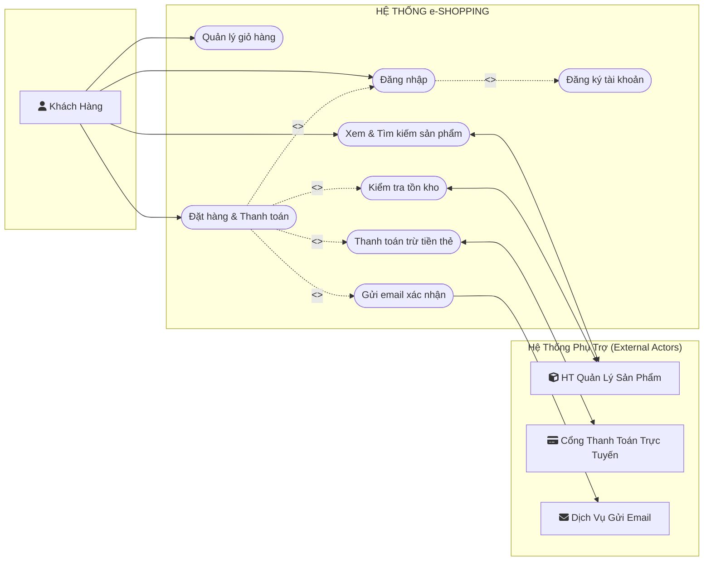

```mermaid
flowchart LR
    %% Actors
    subgraph Actors[" "]
        direction TB
        KhachHang["fa:fa-user Khách Hàng"]
    end

    subgraph ExternalSystems["Hệ Thống Phụ Trợ (External Actors)"]
        direction TB
        HT_SanPham["fa:fa-cube HT Quản Lý Sản Phẩm"]
        HT_ThanhToan["fa:fa-credit-card Cổng Thanh Toán Trực Tuyến"]
        HT_Email["fa:fa-envelope Dịch Vụ Gửi Email"]
    end

    %% Use Cases Boundary
    subgraph eShopping["HỆ THỐNG e-SHOPPING"]
        direction TB
        UC_XemSP(["Xem & Tìm kiếm sản phẩm"])
        UC_GioHang(["Quản lý giỏ hàng"])
        UC_DangNhap(["Đăng nhập"])
        UC_DangKy(["Đăng ký tài khoản"])
        UC_DatHang(["Đặt hàng & Thanh toán"])
        
        %% Use Cases phụ trợ
        UC_KiemTraKho(["Kiểm tra tồn kho"])
        UC_TruTien(["Thanh toán trừ tiền thẻ"])
        UC_GuiMail(["Gửi email xác nhận"])
    end

    %% Tương tác của Khách hàng
    KhachHang --> UC_XemSP
    KhachHang --> UC_GioHang
    KhachHang --> UC_DangNhap
    KhachHang --> UC_DatHang

    %% Quan hệ giữa các Use Cases
    UC_DangNhap -. "<<extend>>" .-> UC_DangKy
    UC_DatHang -. "<<include>>" .-> UC_DangNhap
    UC_DatHang -. "<<include>>" .-> UC_KiemTraKho
    UC_DatHang -. "<<include>>" .-> UC_TruTien
    UC_DatHang -. "<<include>>" .-> UC_GuiMail

    %% Tương tác với Hệ thống ngoài
    UC_XemSP <--> HT_SanPham
    UC_KiemTraKho <--> HT_SanPham
    UC_TruTien <--> HT_ThanhToan
    UC_GuiMail --> HT_Email
```
