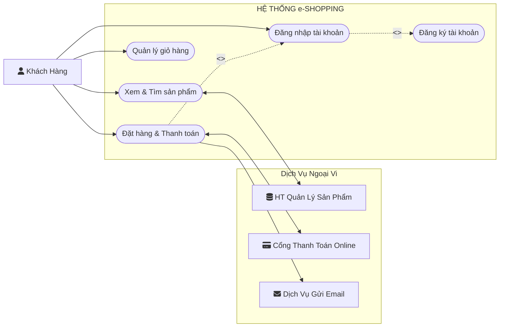

```mermaid
flowchart LR
    KhachHang["fa:fa-user Khách Hàng"]
    
    subgraph External["Dịch Vụ Ngoại Vi"]
        direction TB
        HT_SanPham["fa:fa-database HT Quản Lý Sản Phẩm"]
        HT_ThanhToan["fa:fa-credit-card Cổng Thanh Toán Online"]
        HT_Email["fa:fa-envelope Dịch Vụ Gửi Email"]
    end

    subgraph eShopping["HỆ THỐNG e-SHOPPING"]
        direction TB
        UC1(["Xem & Tìm sản phẩm"])
        UC2(["Quản lý giỏ hàng"])
        UC3(["Đăng nhập tài khoản"])
        UC4(["Đăng ký tài khoản"])
        UC5(["Đặt hàng & Thanh toán"])
    end

    KhachHang --> UC1
    KhachHang --> UC2
    KhachHang --> UC3
    KhachHang --> UC5

    UC3 -. "<<extend>>" .-> UC4
    UC5 -. "<<include>>" .-> UC3

    UC1 <--> HT_SanPham
    UC5 <--> HT_ThanhToan
    UC5 --> HT_Email
```
