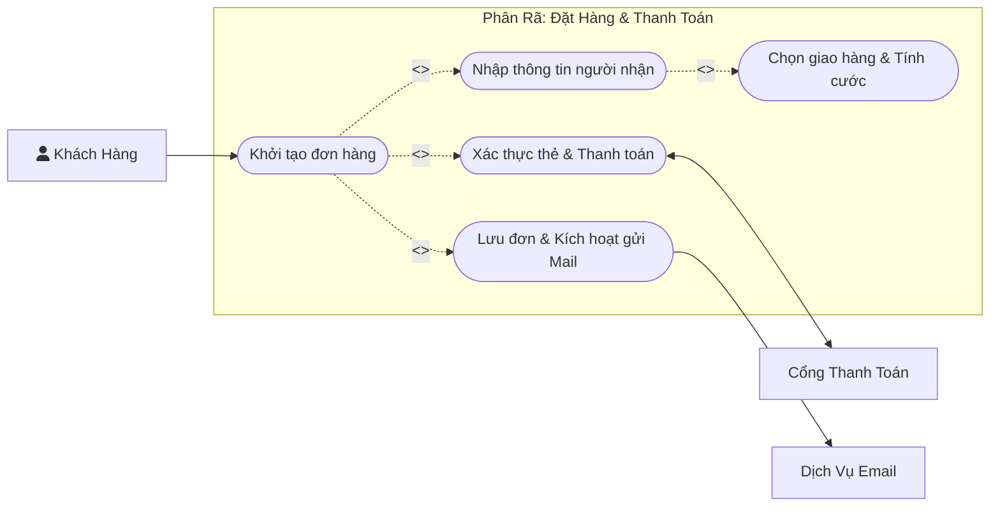

```mermaid
flowchart LR
    KhachHang["fa:fa-user Khách Hàng"]
    Bank["Cổng Thanh Toán"]
    Mail["Dịch Vụ Email"]

    subgraph CheckoutProcess["Phân Rã: Đặt Hàng & Thanh Toán"]
        direction TB
        UC_Init(["Khởi tạo đơn hàng"])
        UC_Receiver(["Nhập thông tin người nhận"])
        UC_Shipping(["Chọn giao hàng & Tính cước"])
        UC_Payment(["Xác thực thẻ & Thanh toán"])
        UC_Invoice(["Lưu đơn & Kích hoạt gửi Mail"])
    end

    KhachHang --> UC_Init
    UC_Init -. "<<include>>" .-> UC_Receiver
    UC_Receiver -. "<<include>>" .-> UC_Shipping
    UC_Init -. "<<include>>" .-> UC_Payment
    UC_Init -. "<<include>>" .-> UC_Invoice

    UC_Payment <--> Bank
    UC_Invoice --> Mail
```
